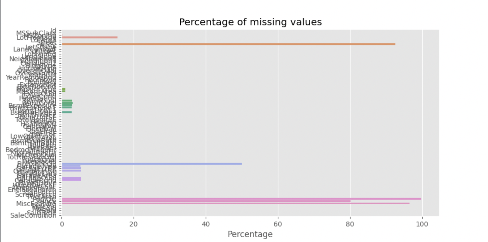
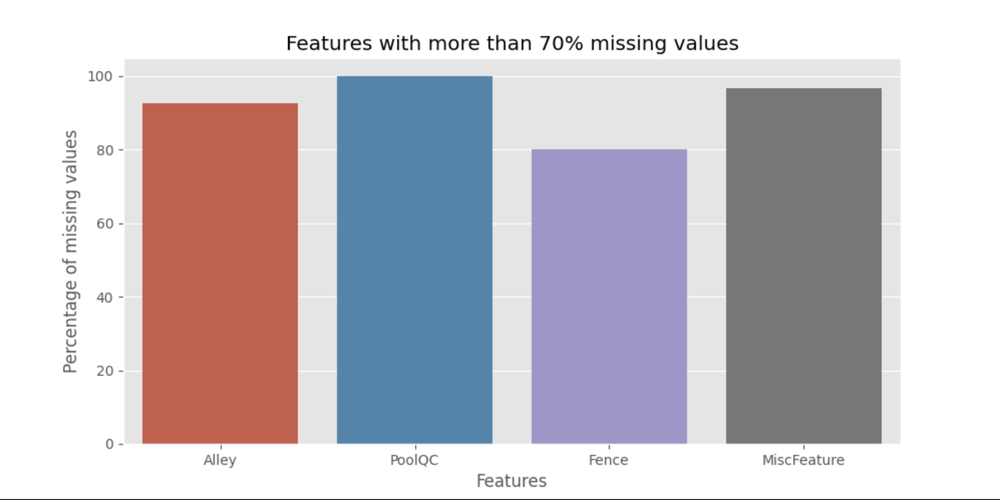
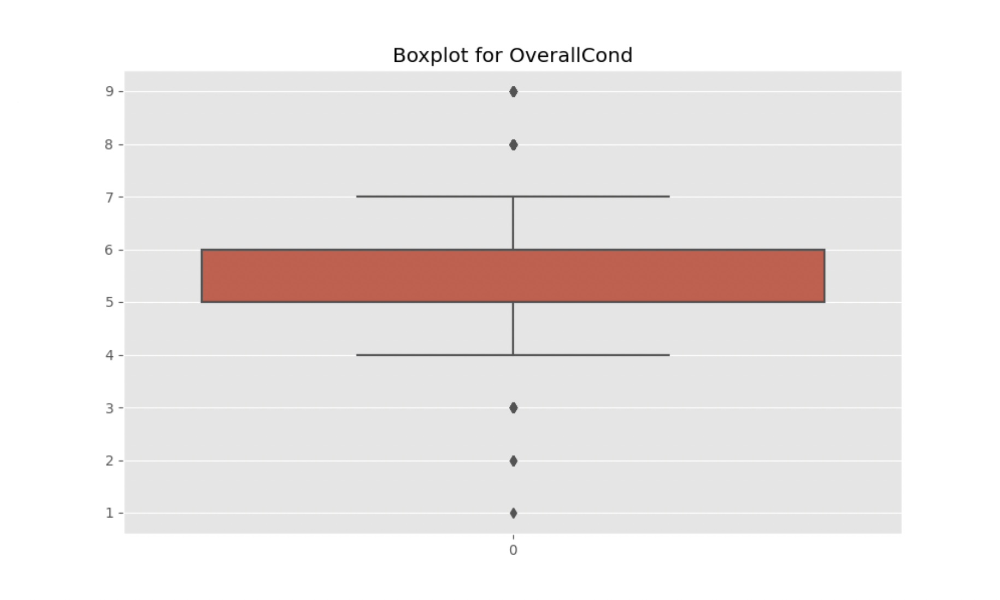
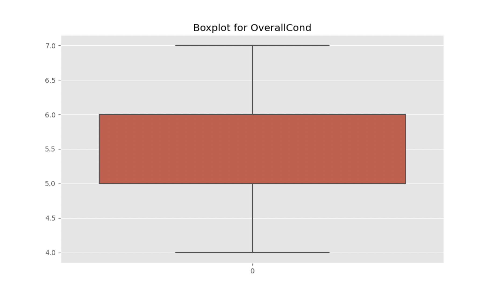

# Kaggle Competition House Pricing

` Paul Bouvignies - M1 EXPERT DEVELOPMENT WEB`  
` Elective : Mathématique fondamentale et machine learning`
 
 
> ## Table of contents
> 1. [Data preparation](#introduction) 
>     1. [Drop of columns with too many missing values](#df1)
>     2. [Replace missing values ](#df2)
>     3. [Get outliers and replace values ](#df3)
>     4. [Transform features by numerical categories](#df4)
> 2. [Model training ](#ml)
>     1. [Linear Regressor](#ml1)
>     2. [Random Forest Regressor](#ml2)
>     3. [Gradien tBoosting Regressor](#ml3)
> 3. [Kaggle submission](#kg)
> 4. [Conclusion](#conclusion)

## 1. Data preparation 
### i. Drop of columns with too many missing values 

The first step was to look at the percentage of missing values in changes features. 
If this percentage is over 70% I choose to delete the feature 

### ii. Replace missing values 
To strengthen the dataset, I replace all missing values by the mean of the features

### iii. Get outliers and replace values 

Ro refine the dataset I replace the exrtemes values by the mean of the feature 

### iv. Transform features by numerical categories 
To allow the training of the model, I convert the features into numerical values that can be computed 

## 2. Model training 
### i. Linear Regressor 
### ii. Random Forest Regressor 
### iii. Gradien tBoosting Regressor 
